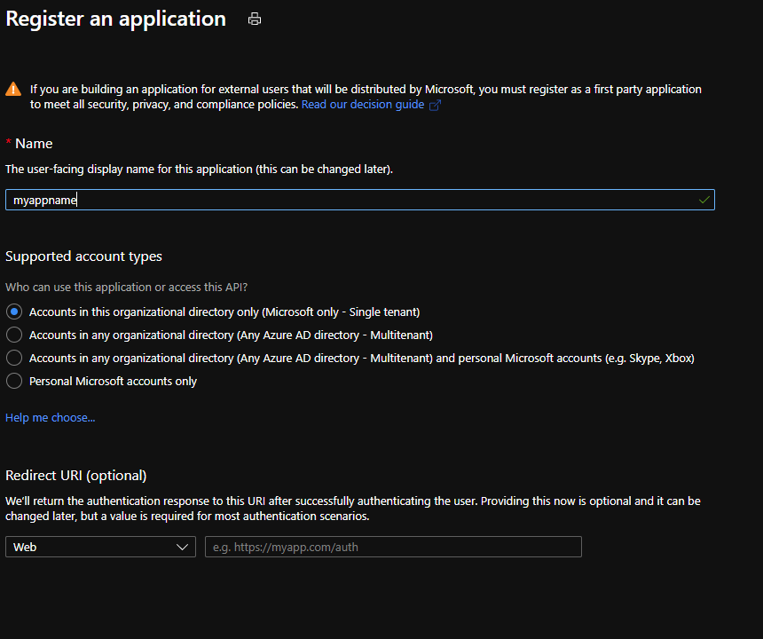
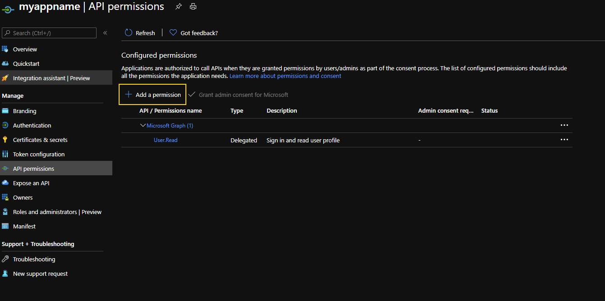
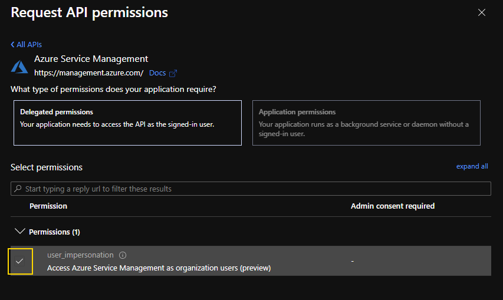

# Device login app registration instructions

1. Browse to Azure Portal
1. Navigate to Azure Active Directory blade and select "App registrations"
1. Click "New registration" and give it a name.   
1. Select API Permissions and click "Add permission"   
1. Choose "Azure Service Management" then select the "user_impersonation" checkbox   
1. Save all changes
1. Update .env file with TenantId and Application (client) Id
